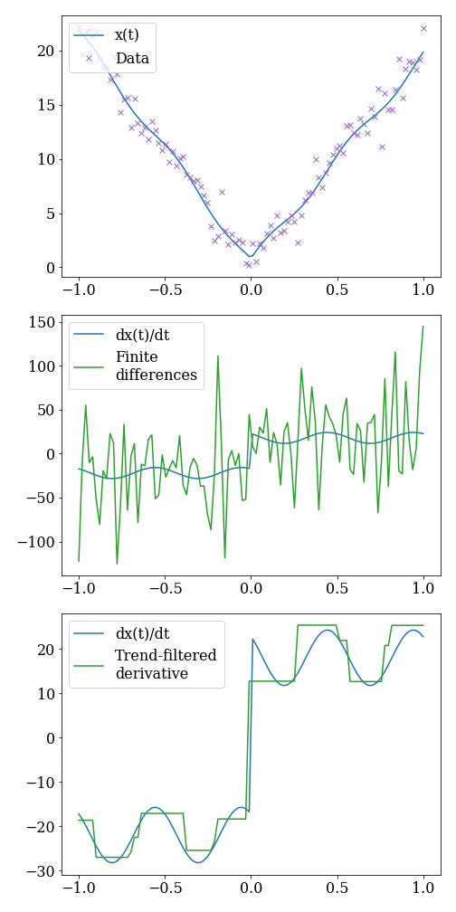

derivative
==========

.. toctree::
    :maxdepth: 1
    :caption: Contents:

    notebooks/Examples.ipynb
    api
    modules
    license

Numerical differentiation of noisy time series data in python
^^^^^^^^^^^^^^^^^^^^^^^^^^^^^^^^^^^^^^^^^^^^^^^^^^^^^^^^^^^^^

    *Measurements of the signal* :math:`x(t) = -t + \sin(2 \pi t - 2)^2 + 20 |t|` *taken from time -1 to 1 with additive gaussian noise (mean 0, variance 1). Notice that not only is there noise, but at t=0 the signal is not even differentiable! This is too much to ask of finite difference methods, but trend-filtered differentiation can help.*

Numerical differentiation methods for noisy time series data in python includes:

.. code-block:: python

    from derivative import dxdt
    import numpy as np

    t = np.linspace(0,2*np.pi,50)
    x = np.sin(x)

    # 1. Finite differences with central differencing using 3 points.
    result1 = dxdt(x, t, kind="finite_difference", k=1)

    # 2. Savitzky-Golay using cubic polynomials to fit in a centered window of length 1
    result2 = dxdt(x, t, kind="savitzky_golay", left=.5, right=.5, order=3)

    # 3. Spectral derivative
    result3 = dxdt(x, t, kind="spectral")

    # 4. Spline derivative with smoothing set to 0.01
    result4 = dxdt(x, t, kind="spline", s=1e-2)

    # 5. Total variational derivative with regularization set to 0.01
    result5 = dxdt(x, t, kind="trend_filtered", order=0, alpha=1e-2)

    # 6. Kalman derivative with smoothing set to 1
    result6 = dxdt(x, t, kind="kalman", alpha=1)

    # 7. Kernel derivative with smoothing set to 1
    result7 = dxdt(x, t, kind="kernel", sigma=1, lmbd=.1, kernel="rbf")

1. Symmetric finite difference schemes using arbitrary window size.

2. Savitzky-Galoy derivatives of any polynomial order with independent left and right window parameters.

3. Spectral derivatives with optional filter.

4. Spline derivatives of any order.

5. Polynomial-trend-filtered derivatives generalizing methods like total variational derivatives.

6. Kalman derivatives find the maximum likelihood estimator for a derivative described by a Brownian motion.

7. Kernel derivatives smooth a random process defined by its kernel (covariance).

The goal of this package is to provide some common numerical differentiation techniques that showcase improvements that can be made on finite differences when data is noisy. 

This package binds these common differentiation methods to a single easily implemented differentiation interface to encourage user adaptation.

References:
===========

[1] Numerical differentiation of experimental data: local versus global methods- K. Ahnert and M. Abel

[2] Numerical Differentiation of Noisy, Nonsmooth Data- Rick Chartrand

[3] The Solution Path of the Generalized LASSO- R.J. Tibshirani and J. Taylor

Indices and tables
==================

* :ref:`genindex`
* :ref:`modindex`
* :ref:`search`
